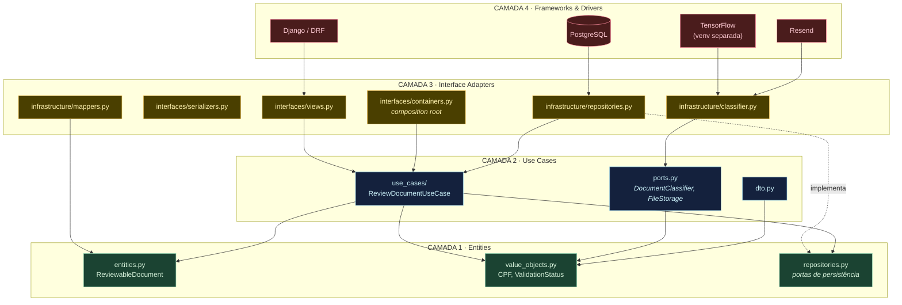
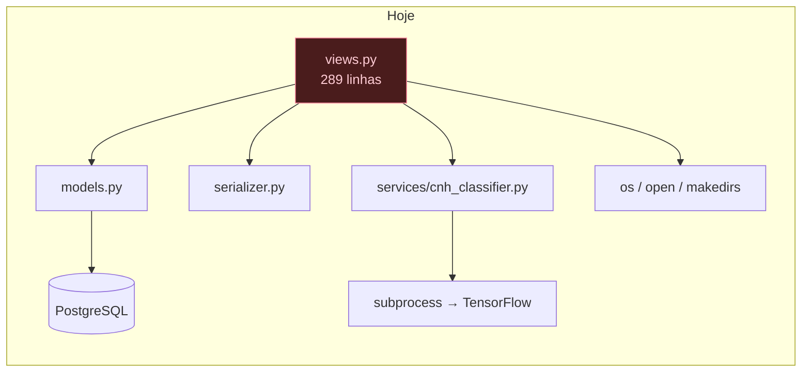

# Diagrama 1 — Regra da Dependência

As quatro camadas e o sentido obrigatório das dependências. **Toda seta aponta para dentro.**

## Como ler

- **Nenhuma seta sai da Camada 1.** O domínio não conhece ninguém. É o teste de aceitação:
  `grep -rE "django|rest_framework" BackEnd/*/domain/` deve retornar vazio.
- A seta pontilhada `repositories.py -.implementa.-> repositories.py (domínio)` é a **inversão de
  dependência**: a interface é declarada pela camada interna, e a implementação, que vive fora,
  aponta para dentro ao satisfazê-la.
- `containers.py` é o único módulo que enxerga todas as camadas — por isso é o único que pode
  instanciar adaptadores concretos.

## Comparação com o estado atual

Uma view depende de tudo, e tudo depende de detalhes. Não existe fronteira que possa ser testada
isoladamente — e é por isso que os seis `tests.py` do projeto continuam com 3 linhas cada.
