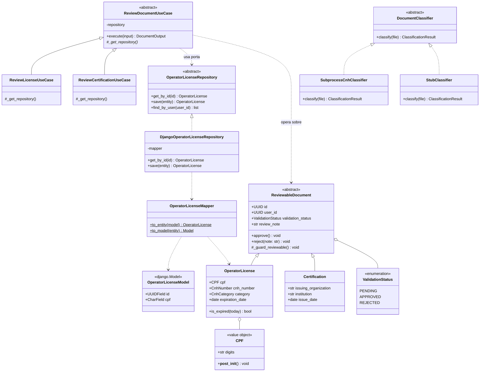

# Diagrama 2 — Classes de `document_validation`

O módulo piloto nas quatro camadas. Portas em itálico (`<<abstract>>`).

## Os três padrões visíveis no diagrama

**Template Method.** `ReviewDocumentUseCase` implementa `execute()` uma única vez; as subclasses só
fornecem o repositório. Isso substitui `views.py:224-255` e `:258-289`, hoje **iguais byte a byte**.

**Data Mapper.** `OperatorLicenseMapper` é o único ponto que conhece as duas representações —
`OperatorLicense` (domínio, sem Django) e `OperatorLicenseModel` (`django.Model`). Nenhuma seta liga
a entidade ao model diretamente.

**Strategy.** `SubprocessCnhClassifier` e `StubClassifier` são intercambiáveis por trás de
`DocumentClassifier`. É o que permite testar sem TensorFlow.

## O que o diagrama não mostra

`interfaces/containers.py` — o composition root que instancia
`ReviewLicenseUseCase(DjangoOperatorLicenseRepository(OperatorLicenseMapper()))`. Ele foi omitido
porque se ligaria a todas as classes ao mesmo tempo, poluindo a leitura. É intencional que ele seja
o único módulo com essa característica.
