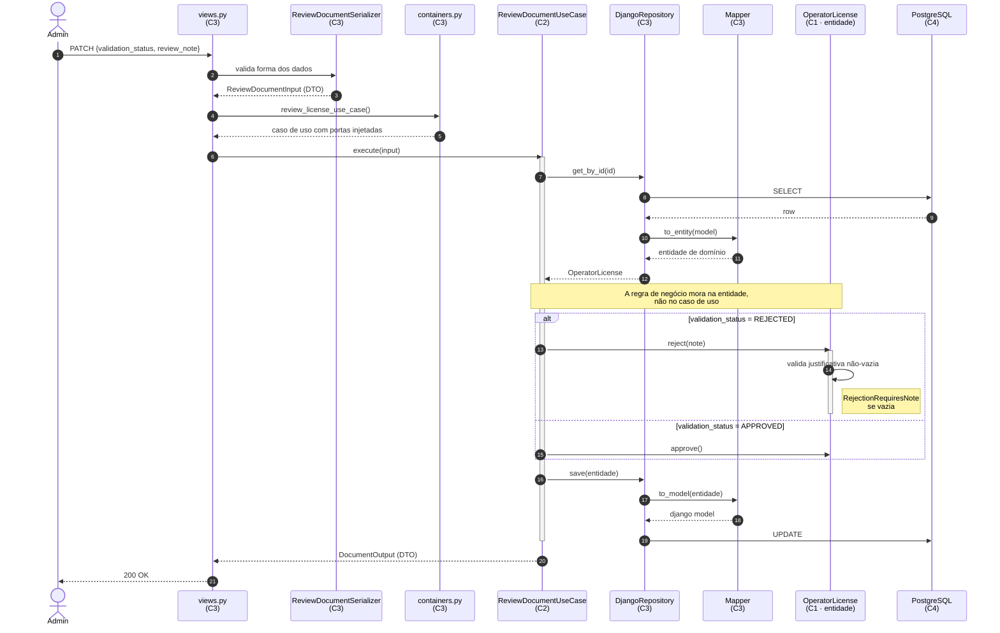
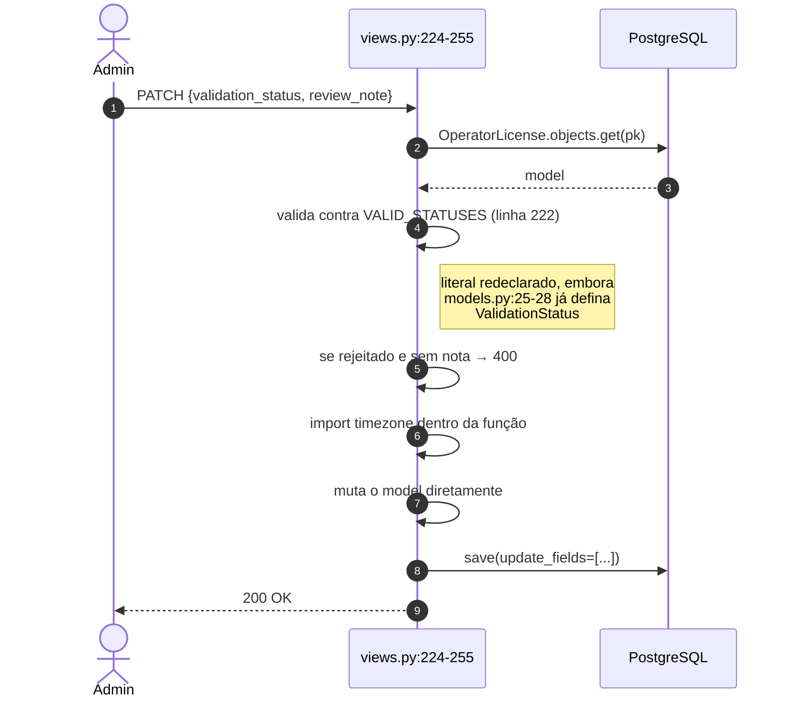

# Diagrama 3 — Sequência: revisão de documento

`PATCH /api/operator-licenses/<pk>/review` atravessando as quatro camadas.

## Depois da refatoração

## Hoje

## Diferenças que importam

| | Hoje | Depois |
|---|---|---|
| Onde está a regra "rejeição exige justificativa" | `views.py:239-243` — e de novo em `:273-277` | `ReviewableDocument.reject()`, uma vez |
| Testável sem HTTP? | Não | Sim |
| Testável sem banco? | Não | Sim — com `InMemoryRepository` |
| Duplicação | Fluxo inteiro repetido para certificação (`:258-289`) | Um caso de uso, duas subclasses |
| Fonte dos status válidos | Literal em `views.py:222` | `ValidationStatus` no domínio |

O passo mais relevante do diagrama é o `alt`: a decisão de negócio acontece **dentro da entidade**.
O caso de uso apenas orquestra — busca, delega, persiste. Se aparecer um `if` sobre estado de domínio
dentro de um caso de uso, essa regra provavelmente pertence à entidade.
