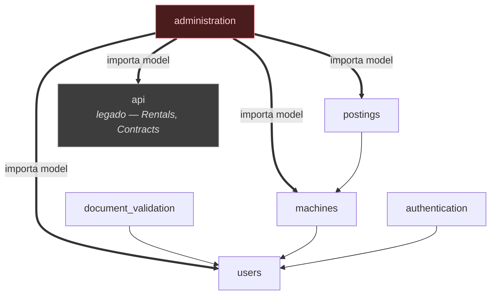
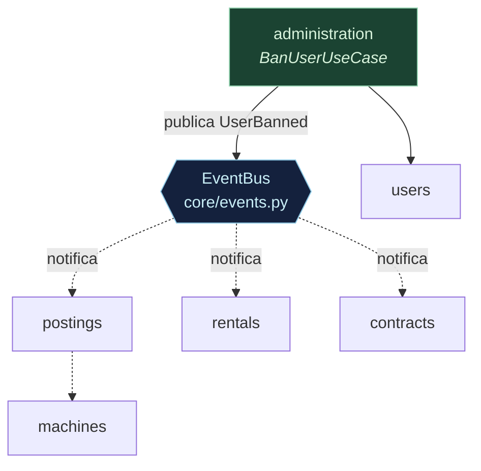

# Diagrama 4 — Bounded contexts e acoplamento

## Hoje: acoplamento por import direto

`administration/views.py:6-9` importa models de quatro contextos:

```python
from api.models import Rentals, Contracts
from machines.models import Machines
from postings.models import Postings
from users.models import Users
```



`ban_user` (`administration/views.py:55-70`) executa **cinco escritas em quatro tabelas de outros
contextos, sem `transaction.atomic`**:

```python
user.status = 'banned'
user.save()
machine_ids = Machines.objects.filter(owner=user).values_list('id', flat=True)
Postings.objects.filter(machinery_id__in=machine_ids).exclude(status='inactive').update(status='inactive')
rental_ids = Rentals.objects.filter(lessee=user, status__in=['pending', 'active']).values_list('id', flat=True)
Rentals.objects.filter(id__in=rental_ids).update(status='cancelled')
Contracts.objects.filter(rental_id__in=rental_ids, status='pending_signatures').update(status='cancelled')
```

Dois problemas distintos: **acoplamento** (qualquer mudança em `Postings` pode quebrar
`administration` sem aviso) e **atomicidade** (uma falha no meio deixa um usuário banido com anúncios
ativos — defeito real, não estilo).

## Depois: Observer + Unit of Work



`administration` deixa de importar models alheios. Cada contexto registra seu próprio handler e
decide o que fazer quando um usuário é banido. Tudo dentro de um Unit of Work, então ou o conjunto
inteiro é aplicado, ou nada é.

```python
class BanUserUseCase:
    def execute(self, input: BanUserInput) -> None:
        with self.uow:
            user = self.users.get_by_id(input.user_id)
            user.ban()                                  # regra na entidade
            self.users.save(user)
            self.events.publish(UserBanned(user_id=user.id))
```

## Mapa dos contextos

| Contexto | Responsabilidade | Observação |
|---|---|---|
| `users` | Cadastro, perfil, estado da conta | `role` e `status` são `TextField` livres — precisam de enum |
| `authentication` | Login, JWT, reset de senha | Integra Resend de forma síncrona |
| `machines` | Frota do locador | `renagro_number` único |
| `postings` | Anúncios, fotos, busca | Regra de sobreposição de datas hoje dentro da view |
| `administration` | Moderação de usuários e anúncios | Único com constante bem modelada: `PostingModeration.ACTION_CHOICES` |
| `document_validation` | CNH e certificações, classificação por ML | Módulo piloto |
| `api` | **Legado** — `Rentals`, `Contracts`, `Messages`, `Reviews` | A extinguir; ver TODO em `api/models.py:17-18` |

`api` ainda concentra quatro entidades de domínio geradas por `inspectdb` — com `models.DO_NOTHING`
em todas as FKs e `id = UUIDField(primary_key=True)` sem default. Extrair `rentals` e `contracts`
como contextos próprios é pré-requisito para o Observer acima funcionar de forma limpa.
