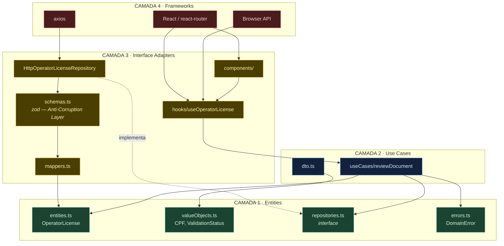
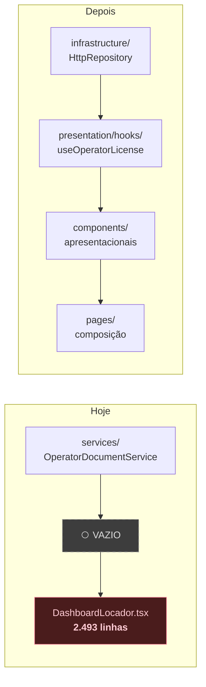
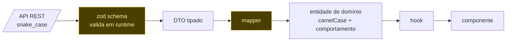

# Diagrama 5 — Camadas do front-end

O mesmo desenho do back-end, espelhado por feature.

## A camada que falta hoje

`DashboardLocador.tsx` não tem 2.493 linhas por descuido. Tem porque **não existe lugar entre
"service" e "JSX"** para lógica com estado — 21 `useState`, 11 abas comutadas por `useState<Tab>` e
mutações escritas dentro de handlers JSX (`:1201-1234`, repetido em `:1357-1373` e `:1492`).

O hook é um **Adapter**: converte um caso de uso, que não conhece React, no modelo de estado que o
React entende.

## Fluxo de dados e a Anti-Corruption Layer

Dois ganhos concretos:

- O `snake_case` da API **para** na fronteira e nunca vaza para o domínio. Hoje ele atravessa a
  aplicação inteira: `license.birth_date`, `validation_status`, `file_url` aparecem direto no JSX.
- O tipo passa a ser verificado em runtime. Hoje `OperatorLicense` é `type`, apagado na compilação —
  se o back-end mudar um campo, a quebra aparece em produção, não no build.

`zod` já está no `package.json` e nunca foi importado, então isso não adiciona dependência.
