# Chat em Tempo Real — como funciona

Este documento descreve o **funcionamento** do chat da Frota Rural: as peças envolvidas,
o modelo de dados, o contrato WebSocket, os caminhos de escrita e leitura, a autorização
e a moderação.

- O **plano congelado** que originou a feature (contrato de API, divisão de trabalho entre
  agentes, decisões de projeto) está em [`README_Chat_Arquitetura.md`](README_Chat_Arquitetura.md).
- Aqui o foco é o **mapa de execução**: quem chama quem, o que trafega, e por quê.

---

## 1. Peças envolvidas

| Camada | Arquivo | Papel |
| --- | --- | --- |
| Roteamento ASGI | `BackEnd/djangoapi/asgi.py` | Separa HTTP (WSGI síncrono) de WebSocket (Channels) |
| Auth do socket | `BackEnd/chat/middleware.py` | Lê o JWT do subprotocolo e popula `scope["user"]` |
| Rota do socket | `BackEnd/chat/routing.py` | `ws/chat` → `ChatConsumer` |
| Consumer | `BackEnd/chat/consumers.py` | Contrato WebSocket: subscribe, send, read, typing, ping |
| Views REST | `BackEnd/chat/views.py` | Inbox, histórico, envio, marcar lida, denunciar |
| Chave da thread | `BackEnd/chat/threads.py` | `thread_id`, grupos do channel layer e **toda** a autorização |
| Escrita | `BackEnd/chat/services.py` | Único caminho de criação de mensagem + rate limit + fan-out |
| Leitura pesada | `BackEnd/chat/selectors.py` | SQL cru do inbox e dos contadores de não lidas |
| Moderação automática | `BackEnd/chat/moderation.py` | Flag suave por palavra bloqueada |
| Modelos | `BackEnd/chat/models.py` | `Messages`, `MessageReports` |
| Moderação admin | `BackEnd/administration/views.py` | `chat_moderation_queue`, `chat_moderation_resolve` |
| Cliente HTTP | `FrontEnd/src/services/ChatService/ChatService.ts` | Único ponto que fala com a API de chat |
| Cliente WS | `FrontEnd/src/hooks/useChatSocket.ts` | Uma conexão multiplexada, reconexão e resync (montado só pelo provider) |
| Badge global | `FrontEnd/src/contexts/ChatUnreadContext.tsx` | Estado do contador de não lidas da Navbar |
| Socket global | `FrontEnd/src/contexts/ChatSocketContext.tsx` | Dono do único WebSocket; fan-out para as telas via `useChatEvents` |
| Tela da conversa | `FrontEnd/src/pages/Mensagens/Mensagens.tsx` | Lista de threads + conversa + composer |
| Inbox dos dashboards | `FrontEnd/src/components/ChatInboxPanel.tsx` | Mesma lista, reaproveitada nos dois dashboards |
| Fila de denúncias | `FrontEnd/src/pages/Admin/Denuncias.tsx` | Tela do administrador |
| Banco | `Database/schema.sql` + `chat/migrations/0001`, `0002` | Tabelas `messages` e `message_reports` |

### Visão geral

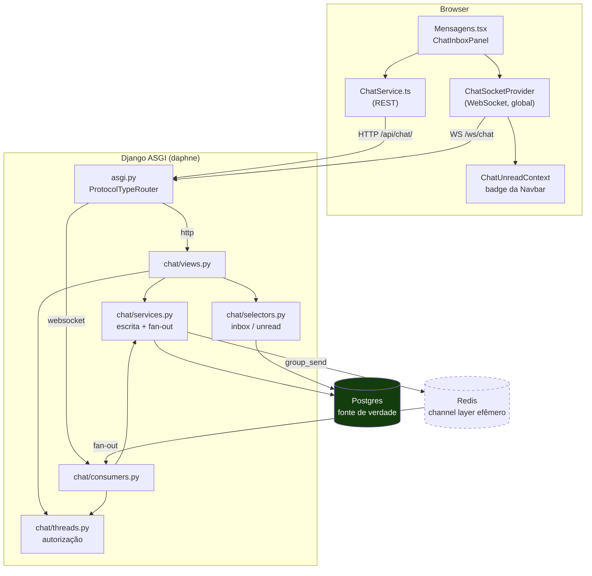

Dois pontos que definem o resto do desenho:

1. **Postgres é a única fonte de verdade.** O Redis é um barramento efêmero entre
   processos ASGI — ele não guarda histórico. Nada que chega com o socket fechado é
   reenviado; a garantia de não perder mensagem é o **resync via REST** na reconexão.
2. **REST e WebSocket compartilham o mesmo código de autorização e escrita**
   (`threads.py` e `services.py`), então os dois caminhos não podem divergir.

---

## 2. Modelo de dados

Não existe tabela `conversations`. A thread é **derivada** das colunas de `messages`.

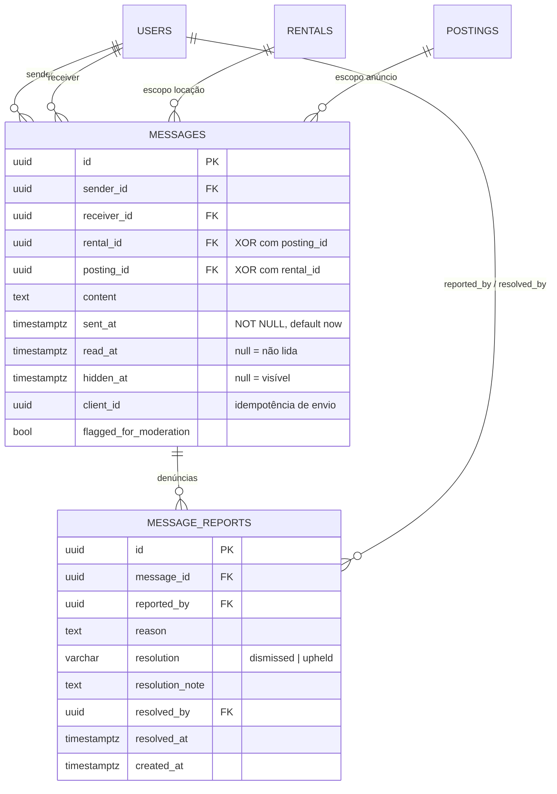

### Invariantes garantidas pelo banco

| Constraint | O que garante |
| --- | --- |
| `messages_exactly_one_scope` (CHECK) | A mensagem pertence **ou** a uma locação **ou** a um anúncio, nunca aos dois nem a nenhum |
| `messages_sender_client_id_uniq` (UNIQUE parcial) | Reenvio com o mesmo `client_id` não duplica a linha |
| `sent_at NOT NULL DEFAULT now()` | A paginação por keyset ordena em `(sent_at, id)` e ficaria incorreta com nulo |
| `message_reports_unique_reporter` (UNIQUE) | Um usuário denuncia a mesma mensagem uma vez só |

### Índices e o que cada um serve

| Índice | Consulta que ele atende |
| --- | --- |
| `idx_messages_rental_thread` / `idx_messages_posting_thread` | Histórico da conversa, paginado por `(sent_at DESC, id DESC)` |
| `idx_messages_sender_recent` / `idx_messages_receiver_recent` | CTE `mine` do inbox |
| `idx_messages_unread` (parcial, `read_at IS NULL`) | Badge de não lidas |
| `idx_messages_flagged` (parcial, `flagged_for_moderation`) | Fila de moderação |

> O modelo `Messages` nasceu no app catch-all `api` e foi movido para `chat` por uma
> migração **state-only** (`api/0004_move_messages_to_chat_app.py` + `chat/0001_initial`):
> o estado do Django muda, a tabela `messages` no banco não é tocada.

---

## 3. A chave da conversa: `thread_id`

```
thread_id := "<scope>:<scope_id>:<user_lo>:<user_hi>"

exemplo: "posting:9b1d…:2f0a…:c7e3…"
             │        │       └──── os dois participantes, ORDENADOS como string
             │        └──────────── id da locação ou do anúncio
             └───────────────────── "rental" ou "posting"
```

Três regras que o `threads.py` impõe:

- **Ordenação canônica.** `parse_thread_id` recusa uma chave fora de ordem. Se aceitasse,
  o mesmo par de usuários geraria dois `thread_id` diferentes e, portanto, dois grupos de
  fan-out — metade das mensagens chegaria só para um lado.
- **A ordenação precisa bater com o SQL.** O `selectors.py` usa `LEAST`/`GREATEST`
  direto nas colunas `uuid` (comparação byte a byte, igual à ordem hexadecimal do Python).
  Um `::text` ali tornaria a ordem dependente de collation e os dois lados discordariam.
- **Nome do grupo é hash.** Grupos do Channels só aceitam `[a-zA-Z0-9._-]` e ~100 chars,
  então `group_name()` devolve `chat.<sha256(thread_id)[:32]>`. Cada usuário também tem um
  grupo próprio, `chat.user.<uuid_hex>`, usado para badge e "thread atualizada".

No frontend o `thread_id` é **opaco**: o `ChatService` nunca o constrói nem o interpreta,
só recebe de `resolveThread`/`listThreads` e devolve ao servidor (url-encoded). É isso que
permite trocar a chave composta por um UUID no dia em que existir uma tabela
`conversations`, sem tocar na UI.

---

## 4. Rotas

### REST (`/api/`)

| Método e rota | View | Chamado por |
| --- | --- | --- |
| `POST /chat/threads/resolve` | `resolve_thread` | `resolveThread` — abre/localiza a conversa (idempotente, não cria nada) |
| `GET /chat/threads/` | `list_threads` | `listThreads` — inbox paginado |
| `GET /chat/threads/<thread_id>` | `get_thread` | `getThread` — abrir por link direto |
| `GET /chat/threads/<thread_id>/messages` | `messages_collection` | `listMessages` — histórico por keyset |
| `POST /chat/threads/<thread_id>/messages` | `messages_collection` | `sendMessage` — **fallback** quando o socket está fechado |
| `POST /chat/threads/<thread_id>/read` | `mark_read` | `markRead` |
| `GET /chat/unread` | `unread` | `getUnread` — badge |
| `POST /chat/messages/<uuid>/report` | `report_message` | `reportMessage` |
| `GET /admin/chat/messages/` | `chat_moderation_queue` | `listFlagged` |
| `PUT /admin/chat/messages/<uuid>/resolve` | `chat_moderation_resolve` | `resolveFlagged` |

> `GET /chat/threads/<thread_id>` existe porque o inbox é derivado da tabela de mensagens:
> uma conversa recém-aberta (zero mensagens) **não aparece** em `GET /chat/threads/`.

### WebSocket

Uma única conexão multiplexada por cliente: `ws://<host>/ws/chat`. As assinaturas de
thread são dinâmicas, então trocar de conversa não custa handshake novo.

| Cliente → Servidor | Servidor → Cliente |
| --- | --- |
| `thread.subscribe` | `thread.subscribed` |
| `thread.unsubscribe` | `message.new` |
| `message.send` | `message.read` |
| `message.read` | `message.hidden` |
| `typing` | `typing` |
| `ping` | `unread.updated` |
| | `thread.updated` |
| | `error` / `pong` |

Falha **por thread** devolve `error` e mantém o socket aberto; só falha de conexão fecha.
Um `type` desconhecido vira `error/invalid_payload`, nunca close.

---

## 5. Autenticação do WebSocket

O token nunca aparece em query string nem em cookie — vai no subprotocolo:

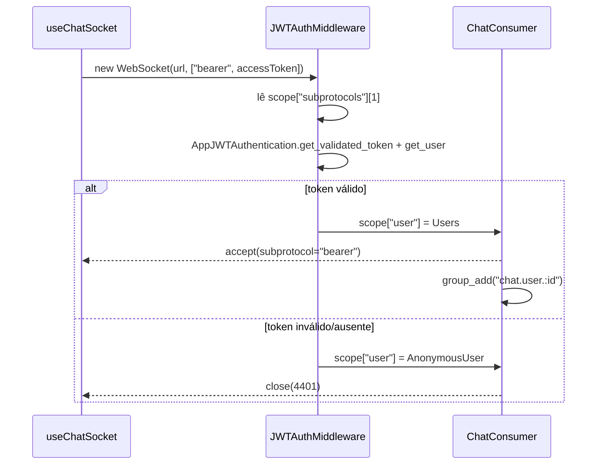

Dois detalhes que valem o destaque:

- **`accept()` precisa devolver o subprotocolo.** Aceitar sem ele faz todo browser fechar
  a conexão na hora, com um `1006` e nenhum erro no servidor. É a falha de integração mais
  provável desta feature, e o primeiro teste do suite cobre exatamente isso.
- **O middleware reaproveita `AppJWTAuthentication`** em vez de decodificar o JWT na mão,
  para não perder a checagem de usuário suspenso/banido feita em `get_user()`.

### Códigos de fechamento

| Código | Significado | Reação do cliente |
| --- | --- | --- |
| `1000` | Fechamento normal | Não reconecta |
| `1006` / `1011` | Erro de transporte | Reconecta com backoff exponencial + jitter |
| `4401` | Token ausente ou inválido | `POST login/refresh` + 1 retry; segundo `4401` → logout |
| `4403` | Autenticado mas proibido | Para de reconectar |
| `4429` | Rate limit | Espera 30 s |

---

## 6. Abrir uma conversa

Os dois pontos de entrada são `AnuncioDetalhe.tsx` (escopo `posting`) e
`AnaliseLocacao.tsx` (escopo `rental`).

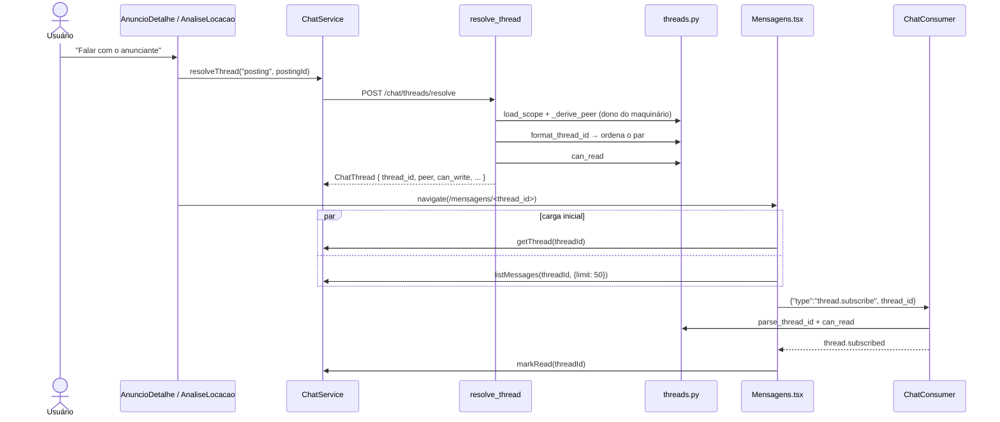

`resolve_thread` é **idempotente e não cria nada** — ele só resolve qual é a chave da
conversa daquele par. `_derive_peer` descobre o outro lado sozinho quando dá:
no escopo `posting`, é o dono do maquinário; no escopo `rental`, é o único outro
participante — se houver mais de um (locatário, dono e operador), o cliente precisa
informar `peer_id`.

---

## 7. Enviar uma mensagem

O caminho feliz é o WebSocket. O REST é o fallback, e os dois desembocam na mesma função.

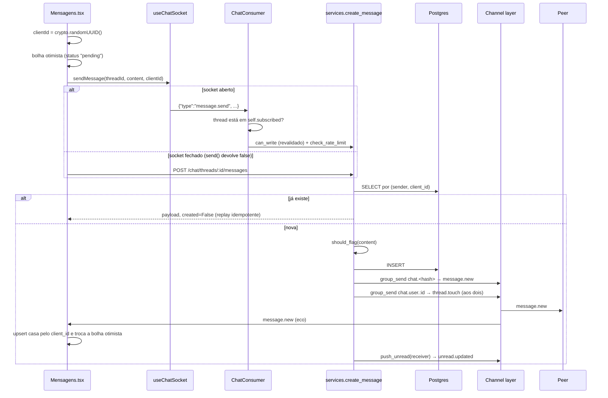

### Por que cada peça está aí

| Peça | Motivo |
| --- | --- |
| `client_id` gerado no cliente | Torna o envio idempotente: retry do WS, fallback REST e eco posterior nunca criam duas linhas. O `upsert` do frontend casa a bolha otimista pelo mesmo id. |
| `IntegrityError` capturado em `create_message` | Corrida no unique parcial `(sender, client_id)`: outro envio idêntico ganhou. Devolve o vencedor em vez de estourar. |
| `can_write` revalidado a cada envio no consumer | O token vale 15 min, mas o socket vive mais. Um usuário banido no meio da sessão para aqui. |
| `json.dumps(payload)` antes do fan-out | Rede de proteção contra a falha que só apareceria com Redis: o `InMemoryChannelLayer` deixaria passar um `UUID`/`datetime` cru; o msgpack do `channels_redis` não. Por isso `serialize_message` devolve só primitivos. |
| `thread.touch` no grupo do usuário | Atualiza o inbox de quem não está com a conversa aberta. |
| Timeout de 10 s no frontend | Se o eco não chega, a bolha vira `failed` e ganha botão de reenviar (mesmo `client_id`). |

### Rate limit

`services.check_rate_limit` é uma janela deslizante **em memória do processo**
(padrão: 20 mensagens / 10 s, configurável). Vale para o abuso acidental que ele existe
para conter; um limite real entre workers exigiria Redis e não valeu a dependência extra.

---

## 8. Recibos de leitura e badge de não lidas

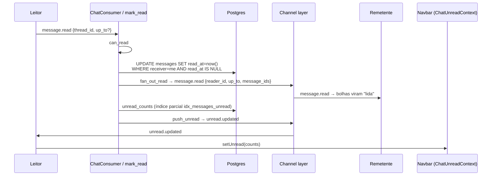

- O `up_to` é opcional; sem ele marca tudo o que estiver pendente na thread.
- A lista de `message_ids` devolvida no fan-out é truncada em 500 — o suficiente para a UI
  atualizar as bolhas visíveis sem inflar o payload.
- O `ChatUnreadContext` busca `GET /chat/unread` uma vez ao autenticar e depois só é
  atualizado por evento, nunca por polling.

### Por que o socket é global

`useChatSocket` é montado uma única vez, em `ChatSocketProvider`, acima das rotas. Isso não
é detalhe de organização: o `unread.updated` chega pelo grupo `chat.user.<id>`, ao qual o
`ChatConsumer` inscreve a conexão no `connect`. Com o hook preso a `Mensagens.tsx`, não
havia socket algum fora daquela tela e o badge congelava no valor buscado no login até o
usuário abrir Mensagens ou recarregar.

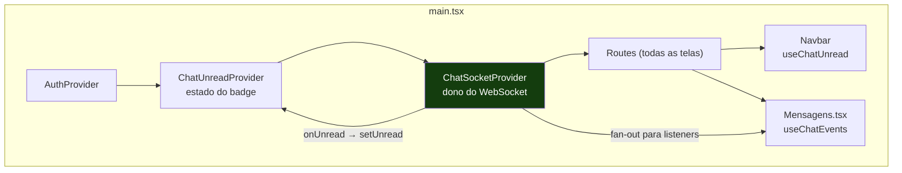

As telas se plugam com `useChatEvents(handlers)`, que registra os handlers num `Set` do
provider e os remove ao desmontar — sair de Mensagens tira os listeners, **não** o socket.
Os handlers não precisam ser memoizados: o registro é um proxy estável que lê a versão mais
recente de um ref, então trocar de conversa não causa registro/desregistro em cascata.

Duas responsabilidades ficaram no provider, e não na tela:

| Responsabilidade | Por quê |
| --- | --- |
| `onUnread` → `setUnread` | É o que faz o badge viver em qualquer rota |
| `onResync` → `refresh()` do contador | Um `unread.updated` emitido com o socket caído não é reenviado; toda reconexão relê `GET /chat/unread` |

### O inbox

`selectors.inbox_page` é **SQL cru de propósito**: a ORM não expressa "última linha por
grupo derivado" sem agregados de `contrib.postgres` e gambiarra de ordenação.

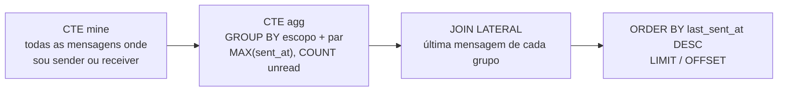

**Custo honesto:** `LEAST`/`GREATEST` em `uuid` não é amigável a índice, então o CTE `mine`
varre todas as mensagens do usuário antes de agregar. Confortável até ~10⁴ mensagens por
usuário; perceptível em 10⁵. O gatilho para migrar para uma tabela `conversations` está
na §10 do plano.

---

## 9. Autorização

`chat/threads.py` é a **única fonte de verdade** — views REST e `ChatConsumer` chamam as
mesmas funções.

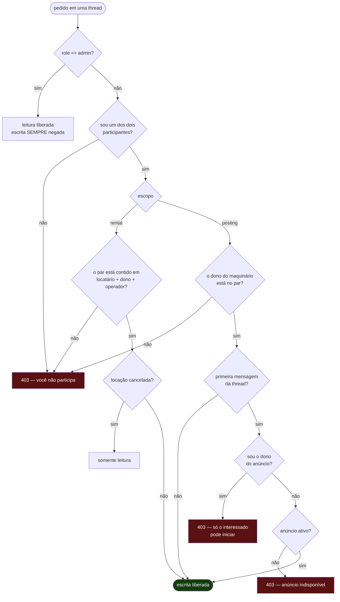

Resumo das regras não óbvias:

| Regra | Motivo |
| --- | --- |
| Admin lê tudo, mas **nunca escreve** | Evita que a moderação injete mensagem numa thread que ela mesma está julgando |
| Só o interessado inicia uma thread de anúncio | Impede que o anunciante use o chat como canal de prospecção fria |
| Locação cancelada vira somente leitura | O histórico continua acessível para disputa; o canal fecha |
| `can_write_bool` alimenta o campo `can_write` da thread | A UI desabilita o composer com o mesmo critério que o servidor aplicaria |

O campo `can_write` viaja no payload da thread, então o `MessageComposer` mostra
"Esta conversa é somente leitura." sem precisar tentar e falhar.

---

## 10. Moderação

Dois caminhos alimentam a mesma fila: a flag automática e a denúncia do usuário.

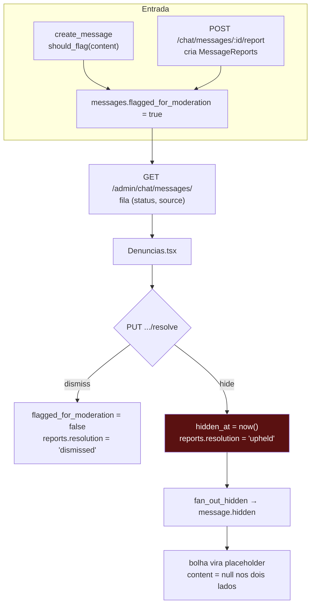

- **A flag automática não bloqueia o envio.** A mensagem é entregue normalmente e só entra
  na fila. Bloquear seria pior: o remetente reescreveria a frase e a denúncia nunca chegaria
  a um humano. As palavras vêm de `CHAT_BANNED_WORDS` (vazio por padrão).
- **Ocultar é soft delete.** `hidden_at` é preenchido, a linha permanece. `serialize_message`
  devolve `content: null` para os participantes e `content` real para o admin
  (`reveal_hidden=is_admin(user)`).
- **Denúncia é única por par (mensagem, denunciante)** e você não pode denunciar a própria
  mensagem — a view devolve `409` e `403` respectivamente.

---

## 11. Reconexão e resync

Este é o ponto mais delicado do desenho, porque o channel layer **não guarda histórico**.

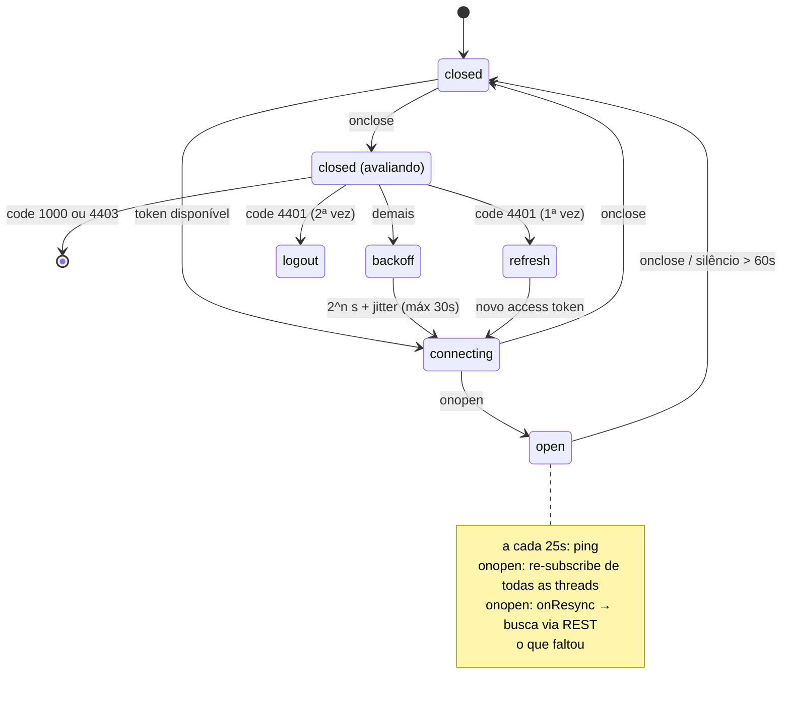

Mecanismos do `useChatSocket`:

| Mecanismo | Função |
| --- | --- |
| `desiredThreads` (ref) | Conjunto de threads que o cliente quer; re-assinado inteiro a cada `onopen` |
| `onResync(threadIds)` | Dispara em toda reconexão. `Mensagens.tsx` pagina `listMessages({after, after_id})` a partir da última mensagem local até esgotar — **é aqui que mora a garantia de entrega**, não no WS |
| Heartbeat de 25 s + silêncio de 60 s | Detecta conexão zumbi (proxy que não fecha o socket) e força o `close` |
| `connectRef` | `connect` se referencia no `onclose`; guardar a versão mais recente num ref evita reconectar com o token da primeira montagem |
| `connecting` (ref) | Guarda contra o StrictMode do React montar o efeito duas vezes e abrir dois sockets |
| `visibilitychange` | Voltar para a aba zera o backoff e reconecta na hora |

---

## 12. Configuração e operação

### Variáveis de ambiente

| Variável | Padrão | Efeito |
| --- | --- | --- |
| `REDIS_URL` | `redis://localhost:6379/0` | Barramento do channel layer |
| `CHANNEL_LAYER_BACKEND` | `redis` | `memory` usa `InMemoryChannelLayer` — **só permitido com `DJANGO_DEBUG=true`** |
| `CHAT_BANNED_WORDS` | vazio | Lista separada por vírgula; vazio desliga a flag automática |
| `CHAT_MAX_MESSAGE_LENGTH` | `4000` | Validado no servidor e no `maxLength` do composer |
| `CHAT_RATE_LIMIT_MESSAGES` | `20` | Envios permitidos por janela |
| `CHAT_RATE_LIMIT_WINDOW_SECONDS` | `10` | Tamanho da janela |
| `VITE_WS_BASE_URL` | derivado de `VITE_API_BASE_URL` | Origem do WebSocket no frontend |
| `DJANGO_SERVER_MODE` | `dev` | `asgi` troca o `runserver` por `daphne` direto |

### Como o servidor sobe

`daphne` vem **antes** de `staticfiles` em `INSTALLED_APPS` porque substitui o comando
`runserver` por um servidor ASGI — o `runserver` do Django 6.0 sozinho ainda é WSGI-only.
Em dev isso mantém o autoreload que o bind mount do compose espera; em produção
(`DJANGO_SERVER_MODE=asgi`) o entrypoint chama `daphne` direto.

O `OriginValidator` usa `CORS_ALLOWED_ORIGINS`, não `AllowedHostsOriginValidator`: o front
roda em `:5173` enquanto `ALLOWED_HOSTS` é `localhost,127.0.0.1`, e a lista de CORS já é
exatamente "quais origens de browser podem falar com a gente".

O serviço `redis` do `compose.yaml` sobe **sem persistência** (`--save "" --appendonly no`):
o channel layer é efêmero, salvar em disco só custaria latência.

### Testes

`BackEnd/chat/tests.py` — 21 testes em 4 classes:

| Classe | Cobre |
| --- | --- |
| `ThreadKeyTests` | Ordenação canônica, parsing e rejeição de chaves inválidas |
| `ConstraintTests` | XOR de escopo e unicidade de `(sender, client_id)` |
| `ChatApiTests` | Contrato REST: resolve, inbox, paginação, autorização, denúncia |
| `ChatConsumerTests` | Handshake com subprotocolo, envio, fan-out, códigos de fechamento |

Os testes do consumer usam `InMemoryChannelLayer` via `@override_settings`, então rodam sem
Redis. O que **não** fica coberto por isso é o fan-out real entre processos.

---

## 13. Armadilhas conhecidas

Coisas que já custaram tempo e estão documentadas no código:

1. **`accept()` sem subprotocolo** → o browser fecha com `1006` e o servidor não registra erro.
2. **Encadear duas views `@api_view`** (`messages_collection` → `_list_messages`) faria o DRF
   reautenticar sobre um request que já tem `user`; o `SessionAuthentication` casaria e passaria
   a exigir CSRF, quebrando todo POST real. O test client do Django desliga CSRF, então isso
   **não apareceria nos testes**. Por isso os helpers são funções puras, sem decorator.
3. **`::text` no `LEAST`/`GREATEST`** tornaria a ordem dependente de collation e o `thread_id`
   do Python passaria a discordar do SQL.
4. **Payload não-primitivo no fan-out** passa no `InMemoryChannelLayer` e estoura no
   `channels_redis` — falha que só aparece em produção.
5. **Atualizar um ref durante o render** (em vez de num efeito) quebra com renders
   concorrentes do React.
6. **Ordem em `/chat/threads/`**: `resolve` e `threads/` precisam ser declarados **antes** de
   `<str:thread_id>`, que casaria com eles também.
