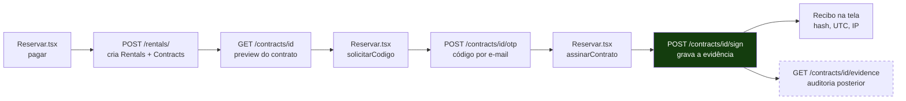
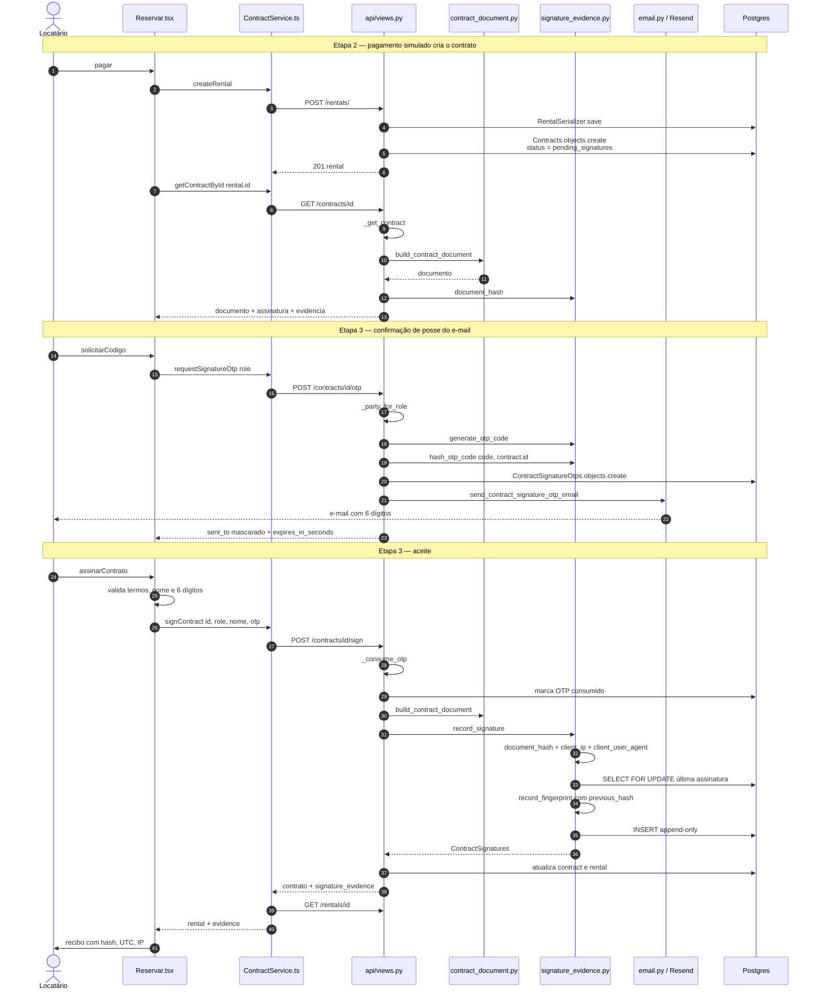
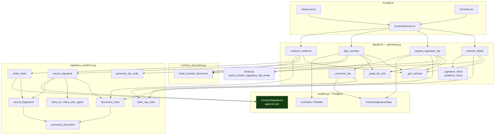
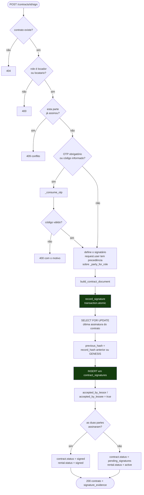
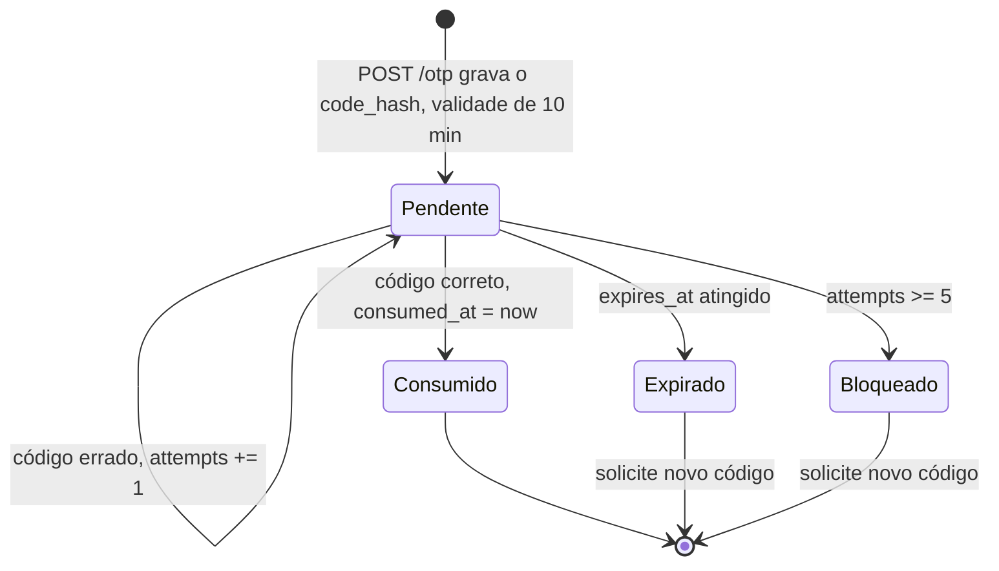
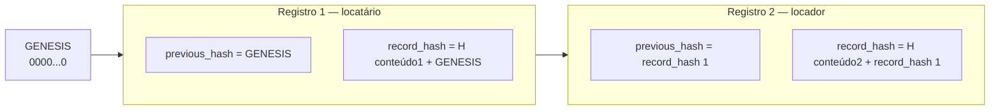
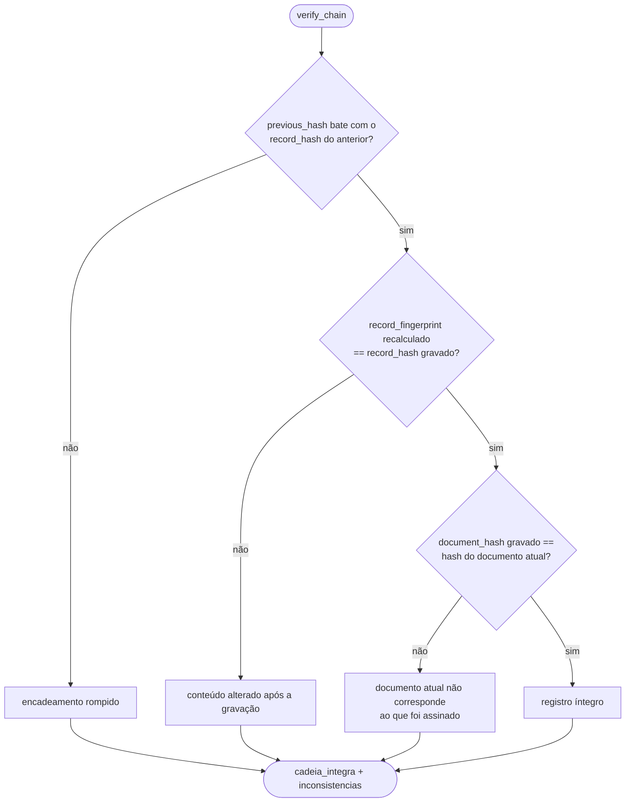
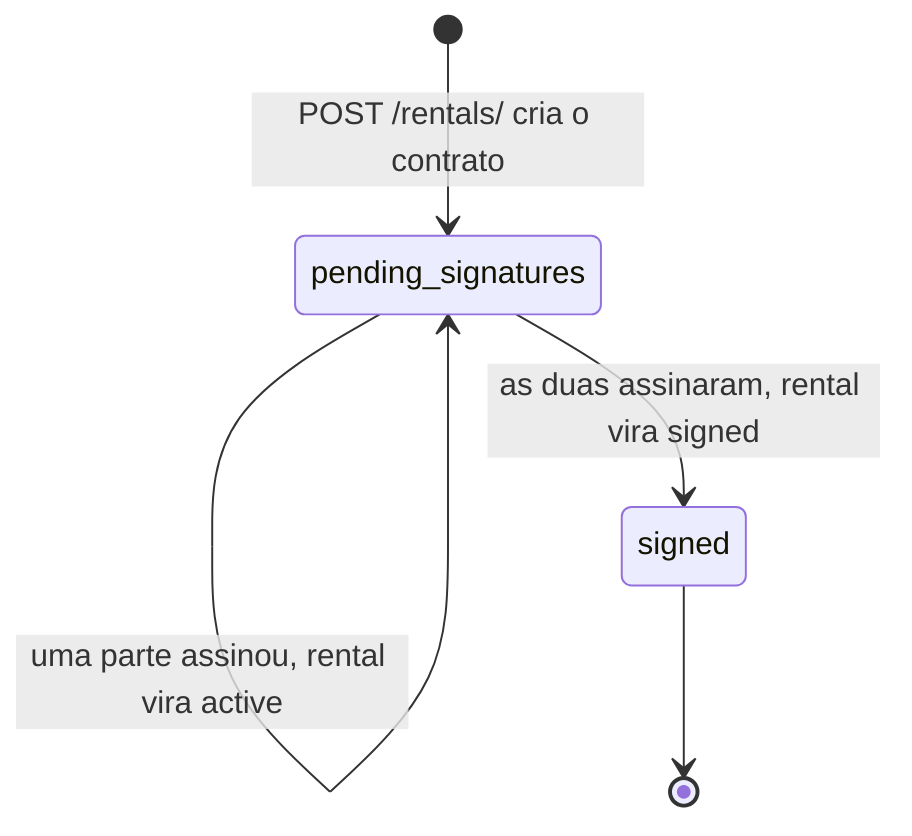
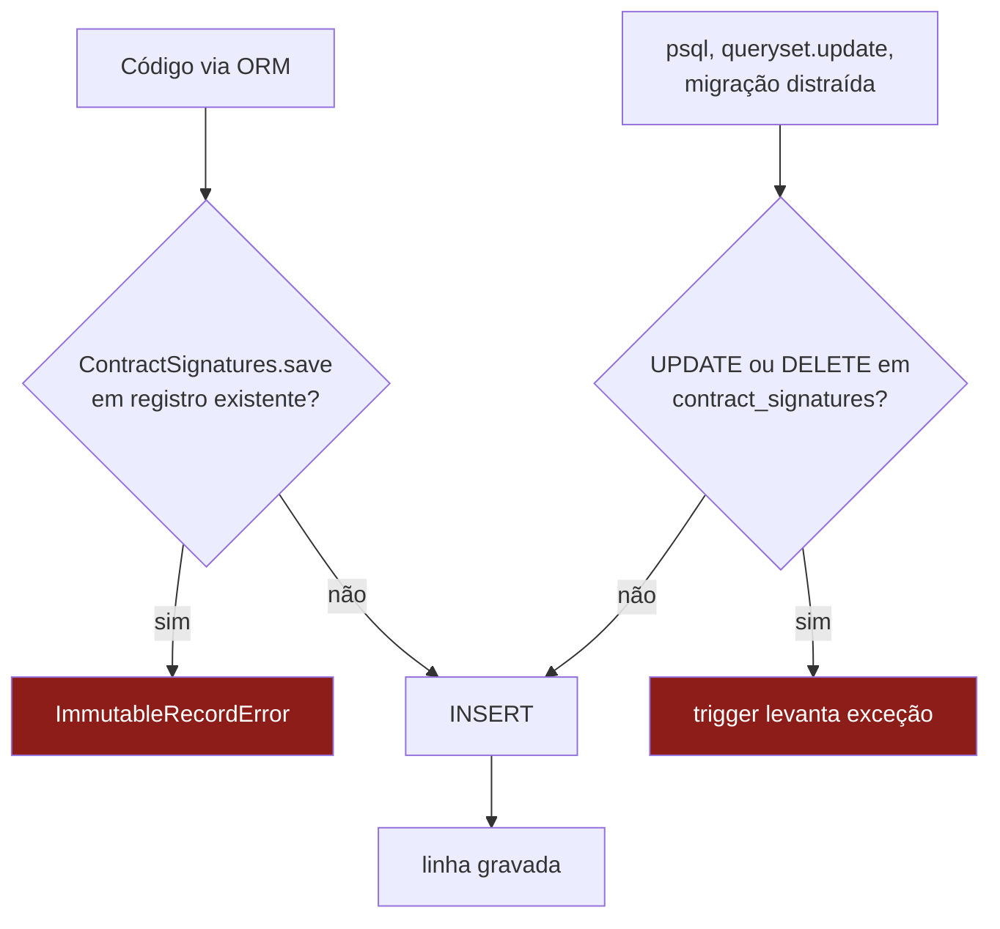

# Fluxo da Assinatura Eletrônica — quem chama quem

Este documento descreve o **caminho de execução** da assinatura de contratos: cada
chamada, do clique no navegador até a linha gravada no Postgres, e o que cada função
faz nesse caminho.

O **porquê** de cada decisão (base legal, canonicalização, encadeamento, imutabilidade)
está na Parte 2 de [`README_Arquitetura_Fotos_e_Assinatura.md`](README_Arquitetura_Fotos_e_Assinatura.md).
Aqui o foco é o mapa de chamadas.

---

## 1. Peças envolvidas

| Camada | Arquivo | Papel no fluxo |
| --- | --- | --- |
| Tela de reserva | `FrontEnd/src/pages/Reservar.tsx` | Etapas de pagamento, OTP, aceite e recibo |
| Tela do contrato | `FrontEnd/src/pages/Contrato/Contrato.tsx` | Leitura do contrato + evidência dos aceites |
| Cliente HTTP | `FrontEnd/src/services/ContractService/ContractService.ts` | Único ponto que fala com a API de contratos |
| Rotas | `BackEnd/api/urls.py` | Mapeia as 4 rotas de contrato |
| Views | `BackEnd/api/views.py` | `contract_detail`, `request_signature_otp`, `sign_contract`, `contract_evidence` |
| Documento | `BackEnd/api/contract_document.py` | Monta o dicionário do contrato a partir dos dados reais |
| Evidência | `BackEnd/api/signature_evidence.py` | Hash, encadeamento, verificação e OTP |
| Modelos | `BackEnd/api/models.py` | `Contracts`, `ContractSignatures`, `ContractSignatureOtps` |
| E-mail | `BackEnd/authentication/emailing/email.py` | `send_contract_signature_otp_email` via Resend |
| Banco | `Database/schema.sql` + migração `0002` | Tabelas e triggers append-only |

### Rotas

| Método e rota | View | Chamado por |
| --- | --- | --- |
| `GET /api/contracts/<id>` | `contract_detail` | `getContractById` |
| `POST /api/contracts/<id>/otp` | `request_signature_otp` | `requestSignatureOtp` |
| `POST /api/contracts/<id>/sign` | `sign_contract` | `signContract` |
| `GET /api/contracts/<id>/evidence` | `contract_evidence` | `getContractEvidence` |

> `<id>` aceita **id do contrato ou id do aluguel** — `_get_contract` resolve os dois
> com `Q(pk=pk) | Q(rental_id=pk)`. O frontend trabalha sempre com o id do aluguel.

---

## 2. Visão geral do fluxo

O passo `evidence` é o único fora da jornada do usuário: existe para auditoria e ainda
não é chamado por nenhuma tela.

---

## 3. Sequência completa — quem chama quem

---

## 4. Mapa de chamadas por arquivo

Duas regras de dependência que o desenho torna visíveis:

- **Todo hash passa por `canonical_document`.** Tanto o hash do documento quanto o do
  registro usam a mesma serialização determinística — se ela mudar, os dois mudam juntos.
- **`record_fingerprint` é usada na gravação e na verificação.** É a mesma função nos
  dois lados; não existe uma versão "de conferência" que possa divergir da original.

---

## 5. O aceite por dentro — `sign_contract`

Três pontos que só aparecem lendo o código:

- **O `select_for_update` serializa aceites concorrentes.** Se as duas partes assinarem
  no mesmo instante, a segunda espera a primeira gravar antes de ler o `previous_hash` —
  sem isso, as duas encadeariam a partir do mesmo registro e a cadeia bifurcaria.
- **O cliente não envia nada que vire evidência.** Hash, timestamp, IP e User-Agent são
  todos derivados no servidor; do corpo da requisição só vêm `role`, `name` e `otp`.
- **Um `IntegrityError` na gravação vira 409**, não 500: o `record_hash` é `UNIQUE`, e a
  colisão significa tentativa de gravar a mesma evidência duas vezes.

---

## 6. Ciclo de vida do código OTP

Como `_consume_otp` busca sempre o registro **mais recente ainda não consumido**
(`order_by("-created_at").first()`), pedir um novo código na prática invalida o
anterior: o antigo continua na tabela, mas deixa de ser o candidato consultado.

Só o `code_hash` é persistido, salgado com o id do contrato
(`sha256(f"{contract_id}:{code}")`). O valor em claro existe apenas no e-mail.

Parâmetros, em `djangoapi/settings.py`:

| Variável | Padrão | Efeito |
| --- | --- | --- |
| `CONTRACT_SIGNATURE_REQUIRE_OTP` | `true` | Exige o código no aceite |
| `CONTRACT_OTP_TTL_SECONDS` | `600` | Validade do código |
| `CONTRACT_OTP_MAX_ATTEMPTS` | `5` | Tentativas antes de bloquear |

Mesmo com a exigência desligada, um código **informado e errado** recusa a assinatura.

---

## 7. A cadeia de hashes e sua verificação

`verify_chain(contract, document)` percorre os registros em ordem de `signed_at` e faz
**três conferências por registro**:

A terceira conferência é a que detecta mudança **no cadastro** depois de assinado: se
alguém alterar o modelo do maquinário, o documento muda, o hash muda, e a divergência
aparece — a assinatura segue íntegra, mas deixa de corresponder ao documento atual.

O `record_hash` cobre todos os campos da evidência **mais** o `previous_hash`, então
alterar um IP no registro 1 quebra o `previous_hash` do registro 2 e assim por diante.

---

## 8. Estados do contrato e do aluguel

| Situação | `contracts.status` | `rentals.status` |
| --- | --- | --- |
| Contrato recém-criado | `pending_signatures` | `pending` |
| Uma parte assinou | `pending_signatures` | `active` |
| As duas assinaram | `signed` | `signed` |

---

## 9. Imutabilidade — duas camadas no caminho da escrita

A camada do banco existe porque a do modelo só protege quem passa pelo ORM. As triggers
`contract_signatures_no_update` e `contract_signatures_no_delete` são criadas tanto pela
migração `0002` quanto pelo `Database/schema.sql`.

> **Consequência prática:** não dá para apagar assinaturas de teste com `DELETE`. Para
> ensaiar, rode dentro de uma transação e faça rollback; para limpar um banco de
> desenvolvimento, derrube as triggers antes.

---

## 10. O que o servidor devolve em cada rota

| Rota | Campos principais |
| --- | --- |
| `GET /contracts/<id>` | `contrato`, `operacao`, `locador`, `locatario`, `equipamento`, `anuncio`, `assinatura` (datas), `evidencia` (`hash_documento_atual`, `assinaturas[]`) |
| `POST /contracts/<id>/otp` | `sent_to` (e-mail mascarado), `expires_in_seconds` |
| `POST /contracts/<id>/sign` | contrato serializado + `signature_evidence` (registro completo) |
| `GET /contracts/<id>/evidence` | `documento` (versão, hash, algoritmo), `cadeia_integra`, `inconsistencias[]`, `assinaturas[]`, `fundamento_legal` |

O bloco `assinatura` **não entra no hash**: ele muda a cada aceite, e se entrasse cada
parte assinaria um hash diferente do mesmo contrato.

---

## 11. Estado atual da implementação

- **Só o locatário assina pela interface.** A API aceita `role: "locador"` e exige OTP
  também para ele, mas não existe tela — nenhum componente do frontend chama
  `signContract` com `"locador"`. O `_party_for_role` já resolve o locador como
  `contract.rental.postings.machinery.owner`.
- **`GET /contracts/<id>/evidence`** existe no backend e em `getContractEvidence`, mas
  nenhuma tela o consome ainda.
- **`ContractService.signContract` faz uma segunda chamada** (`getRentalById`) logo após
  o aceite, para devolver o aluguel já atualizado junto do recibo.
- **Pagamento é simulado** (`setTimeout` de 1,2 s em `Reservar.tsx`); o contrato é criado
  automaticamente no `POST /rentals/`, independentemente disso.
- **Sem carimbo de tempo de terceiro.** O `signed_at` é do relógio do servidor.
