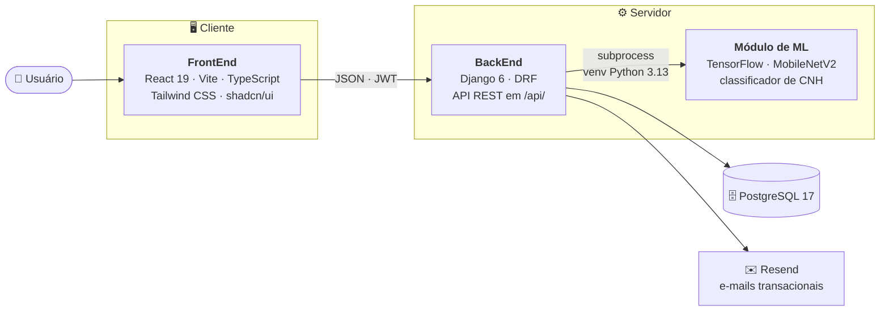
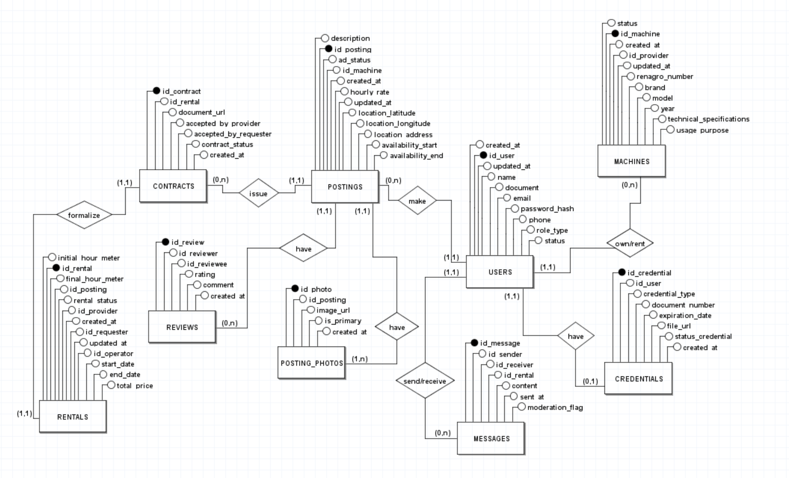

<div align="center">


# 🚜 Frota Rural

### Conectando o campo com tecnologia e eficiência.

Marketplace de **locação de maquinário agrícola** que aproxima quem tem máquina ociosa de quem precisa dela na safra — do anúncio ao contrato assinado, em um só lugar.
<br />


<br />

<br />

[](https://react.dev)
[](https://www.typescriptlang.org)
[](https://www.djangoproject.com)
[](https://www.python.org)
[](https://www.postgresql.org)
[](https://www.tensorflow.org)

<samp>

[**Sobre**](#-sobre-o-projeto) &nbsp;•&nbsp;
[**Funcionalidades**](#-funcionalidades) &nbsp;•&nbsp;
[**Arquitetura**](#-arquitetura) &nbsp;•&nbsp;
[**Stack**](#-stack-de-tecnologias) &nbsp;•&nbsp;
[**Executar**](#-como-executar-o-projeto) &nbsp;•&nbsp;
[**API**](#-documentação-da-api) &nbsp;•&nbsp;
[**Equipe**](#-equipe)

</samp>

</div>

---

## 📖 Sobre o Projeto

No agronegócio, colheitadeiras e tratores passam boa parte do ano parados, enquanto pequenos e médios produtores não conseguem arcar com a compra desses equipamentos. O **Frota Rural** atende os dois lados desse problema: gera **receita para o Locador** e dá **acesso ao maquinário para o Locatário**, com contratos digitais e validação de documentos automatizada.

> **Locador** anuncia a máquina → **Locatário** busca, compara e reserva → a plataforma gera o **contrato digital**, valida a **CNH do operador via Machine Learning** e acompanha a locação até a avaliação final.

---

## ✨ Funcionalidades

| | Módulo | O que entrega |
|:---:|:---|:---|
| 📢 | **Anúncios** | Cadastro de tratores, colheitadeiras e outros equipamentos, com fotos, horas de uso, valor por hora e localização. |
| 🔎 | **Busca e Reserva** | Filtros por período, atividade e região, com fluxo completo de reserva do equipamento. |
| 📝 | **Contratos Digitais** | Geração, assinatura e gestão do ciclo de vida do contrato de locação. |
| 🤖 | **Validação por ML** | Classificador em TensorFlow (MobileNetV2) confirma se o documento enviado é uma CNH válida. |
| 💬 | **Mensagens e Avaliações** | Comunicação entre as partes e reputação pública de locadores e locatários. |
| 📊 | **Dashboards** | Painéis distintos para Locador, Locatário e Administrador, com métricas da operação. |
| 🔐 | **Autenticação** | Login com JWT, recuperação de senha por e-mail e rotas protegidas por perfil. |

---

## 🧱 Arquitetura



O backend roda em **Python 3.14** e o módulo de ML em **Python 3.13** (última versão suportada pelo TensorFlow). Por isso existem **dois ambientes virtuais isolados**, e a comunicação entre eles acontece via `subprocess` com arquivos temporários.

<details>
<summary><b>🗂️ Modelo conceitual do banco de dados</b></summary>

<br />

<div align="center">
  
</div>

<br />

O script de criação do schema está em [`Database/schema.sql`](Database/schema.sql).

</details>

---

## 🧰 Stack de Tecnologias

| Camada | Tecnologias |
|:---|:---|
| **FrontEnd** | React 19 · TypeScript · Vite · Tailwind CSS 4 · shadcn/ui · React Router 7 · React Hook Form + Zod · Axios · Recharts · Framer Motion |
| **BackEnd** | Python 3.14 · Django 6 · Django REST Framework · SimpleJWT · drf-spectacular · psycopg 3 |
| **Banco de Dados** | PostgreSQL 17 |
| **Machine Learning** | Python 3.13 · TensorFlow 2.21 (MobileNetV2) · Pillow · pdf2image |
| **Serviços e DevOps** | Resend (e-mail) · GitHub Actions · Postman |

---

## 🚀 Como Executar o Projeto

### Pré-requisitos

| Ferramenta | Versão | Para quê |
|:---|:---|:---|
| Node.js | 20+ (npm 10+) | FrontEnd |
| Python | 3.14 | BackEnd Django |
| Python | 3.13 | Módulo de ML (TensorFlow) |
| PostgreSQL | 17 | Banco de dados |
| Poppler | — | Leitura de PDFs no ML (`brew install poppler` no macOS) |

### Desenvolvimento containerizado (recomendado)

O ambiente reproduzível — PostgreSQL, Django, dependências de ML e Vite — pode ser
iniciado sem instalar Python, Node, PostgreSQL ou Poppler no host:

```bash
cp .env.example .env
docker compose up --build
```

Consulte [`Devops/README.md`](Devops/README.md) para os serviços, comandos e dados
de desenvolvimento. A decisão de arquitetura está em
[`Documentation/adr/0001-containerized-development-environment.md`](Documentation/adr/0001-containerized-development-environment.md).

### 1. Banco de dados (execução sem containers)

Crie um banco local chamado `frota_rural` e, na raiz de `BackEnd/`, um arquivo `.env`:

```env
DB_NAME=frota_rural
DB_USER=postgres
DB_PASSWORD=sua_senha
DB_HOST=localhost
DB_PORT=5432
FRONTEND_URL=http://localhost:5173
RESEND_API_KEY=sua_chave_resend
```

### 2. BackEnd (Django · Python 3.14)

```bash
cd BackEnd
python3.14 -m venv venv
source venv/bin/activate    # MacOs   
venv\Scripts\activate.ps1   # Windows
pip install -r docs/requirements.txt
python manage.py migrate
python manage.py runserver
```

> 🌐 API disponível em **http://127.0.0.1:8000/**

<details>
<summary><b>Popular o banco com dados de teste</b></summary>

<br />

Com o ambiente virtual ativo, execute o script de seed dentro de `BackEnd/`:

```bash
python seed.py
```

</details>

### 3. Módulo de ML (TensorFlow · Python 3.13)

```bash
cd BackEnd/ml
python3.13 -m venv venv
source venv/bin/activate    # MacOs   
venv\Scripts\activate.ps1   # Windows
pip install -r requirements.txt
```

> ⚙️ Não é preciso iniciar nada: o Django chama o `classify.py` neste interpretador isolado automaticamente.

### 4. FrontEnd (React · Vite)

```bash
cd FrontEnd
npm install
npm run dev
```

> 🌐 Aplicação disponível em **http://localhost:5173/**

---

## 📚 Documentação da API

Com o backend rodando, a documentação **OpenAPI 3** é gerada automaticamente pelo `drf-spectacular`:

| Recurso | Endereço |
|:---|:---|
| 🧭 **Swagger UI** | http://127.0.0.1:8000/api/schema/swagger-ui/ |
| 📘 **ReDoc** | http://127.0.0.1:8000/api/schema/redoc/ |
| 🧾 **Schema OpenAPI** | http://127.0.0.1:8000/api/schema/ |
| 🛠️ **Django Admin** | http://127.0.0.1:8000/admin/ |

As coleções do Postman ficam em [`BackEnd/docs/postman/`](BackEnd/docs/postman).

---

## 📂 Estrutura de Diretórios

```text
Frota_Rural/
├── BackEnd/                  # API REST em Django
│   ├── djangoapi/            # Configurações do projeto, settings e rotas raiz
│   ├── api/                  # Models e regras de negócio principais
│   ├── authentication/       # Login, JWT e recuperação de senha
│   ├── users/                # Perfis de locador, locatário e administração
│   ├── machines/             # Cadastro e gestão de maquinário
│   ├── postings/             # Anúncios, reservas e contratos
│   ├── document_validation/  # Integração com o classificador de CNH
│   ├── administration/       # Endpoints administrativos
│   ├── ml/                   # Treino e inferência (TensorFlow) + venv próprio
│   ├── docs/                 # requirements.txt e coleções Postman
│   └── manage.py
│
├── FrontEnd/                 # Interface web
│   ├── src/
│   │   ├── pages/            # Telas da aplicação
│   │   ├── components/       # Componentes reutilizáveis e UI (shadcn)
│   │   ├── services/         # Camada de acesso à API
│   │   ├── contexts/         # Estado global (autenticação)
│   │   └── utils/            # Helpers
│   ├── Design_System/        # Protótipos e referências visuais
│   └── package.json
│
├── Documentation/            # Requisitos, diagramas e especificações
├── Database/                 # Modelo conceitual e schema.sql
├── Devops/                   # Backlog e artefatos de gestão
└── README.md
```

---

## 👥 Equipe

<div align="center">

<table>
  <tr>
    <td align="center" width="160">
      <a href="https://github.com/bptiago">
        <br />
        <sub><b>Tiago Prestes</b></sub>
      </a>
    </td>
    <td align="center" width="160">
      <a href="https://github.com/joaoson">
        <br />
        <sub><b>João Vitor de Freitas</b></sub>
      </a>
    </td>
    <td align="center" width="160">
      <a href="https://github.com/carloshobmeier">
        <br />
        <sub><b>Carlos Hobmeier</b></sub>
      </a>
    </td>
    <td align="center" width="160">
      <a href="https://github.com/mandiqs">
        <br />
        <sub><b>Amanda Queiroz</b></sub>
      </a>
    </td>
  </tr>
</table>

</div>

---

<div align="center">

<sub>🌱 <b>Frota Rural</b> © 2026 — Transformando a locação de maquinário agrícola.</sub>

<br />

<sub><a href="#-frota-rural">▲ voltar ao topo</a></sub>

</div>
